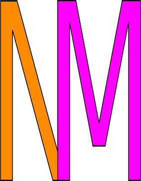

    

## About naynayren.github.io

This is the codebase for my portfolio/resume site. I'm a Junior Web Developer trying to make this a new career. It's a collection of little bits about me like:

- a return to school after 20+ years
- my 25+ years of work history
- some web projects made
- ways of contacting me
- and some love for my puppy

The stack used to build this portfolio is HTML, CSS, vanilla JavaScript, and a carousel-like slider that's used for my projects called <a href="https://nickpiscitelli.github.io/Glider.js/">Glider.js</a>. I'm always tweaking or adding or updating and pushing to this build as my home base of sorts.

My logo above is linked to my actual site.

## Projects Built

These projects also have their codebase kept here. They are viewable through the list below, or through the Projects section of my personal site above.

- **[ISS Current Location](https://naynayren.github.io/iss-location/)**
- **[My Lil' Calculator](https://naynayren.github.io/calculator/)**
- **[Your Social Offers Rebate App](https://ysot.yso.co/)**
- **[Linux Audio Pop Fix](https://naynayren.github.io/linux-audio-pop/)**
- **[Shine n' Shimmer Pool Service](https://naynayren.github.io/shine-shimmer/)**
- **[Just Breathe Meditation App](https://naynayren.github.io/inhale-exhale/)**
- **[Summit Massage](https://naynayren.github.io/summit-massage/)**
- **[Fur Babies Canine Boutique](https://naynayren.github.io/fur-baby/)**
- **[Text to Speech App](https://naynayren.github.io/text-to-speech/)**

## Thank You

If you like or enjoy what you see, please feel free to contact me. If you're reading this, thank you for stopping by with intrigue as to what I've created.

Have a wonderful day. o/
